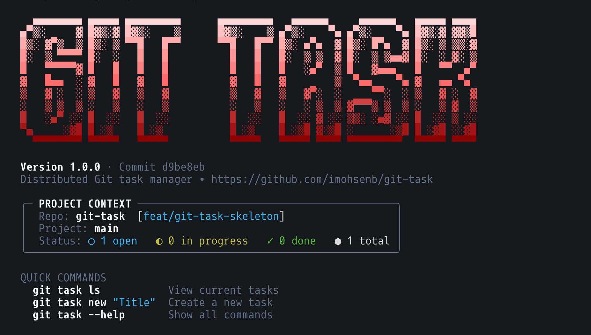

# git-task



A git-native task manager. Tasks live inside the repo as git objects under `refs/tasks/*` —
event-sourced operations, no working-tree files, full history, push/pull like any other ref.
A user-level config lets you register repos across machines and group them by project, so
`git task ls` can show tasks across every repo you work in without `cd`-ing into each one.


## Install

```sh
cargo install --locked --path .
```

This installs two binaries from the same codebase:

- **`git-task`** — required exact name for git's subcommand dispatch; makes `git task ...` work.
- **`gtask`** — a short alias for using the CLI standalone, without going through git: `gtask new "title"`.

Both accept the same commands; pick whichever fits how you're invoking it.

## Usage

```sh
# inside a repo
git task new "Fix login timeout" --kind bug --priority high --label auth
gtask new "Write onboarding docs"        # same thing, standalone form

git task show SRV-9057e58a               # KEY-hash address (see below)...
git task show 9057e58a                   #  ...or a bare hash prefix, same result
git task show SRV-9057e58a --markdown    # markdown instead of the boxed view
git task show SRV-9057e58a --format json # single JSON document on stdout (see below)
git task whoami                          # what identity a write would be attributed to

git task status SRV-9057e58a doing       # free-form status, no workflow lock-in
git task comment SRV-9057e58a "found the root cause"
git task comment SRV-9057e58a --edit 1 "revised note"
git task edit SRV-9057e58a --priority critical --assignee alice@example.com
git task edit SRV-9057e58a --clear-assignee --clear-due   # unset a field (also: --clear-priority/--clear-milestone)
git task edit SRV-9057e58a                    # no flags: interactive, enter keeps current value
git task label SRV-9057e58a add urgent
git task label SRV-9057e58a rm urgent
git task log SRV-9057e58a                # full audit trail
git task export --all --format md        # dump every task in the repo
git task delete SRV-9057e58a             # soft delete — an event, syncs, hidden from ls by default
git task drop SRV-9057e58a --force       # hard delete — removes the local ref, no event
git task drop SRV-9057e58a --force --remote   # ...and delete it on "origin" too

# epics, links, milestones
git task new "Design new UI" --kind story --parent SRV-epic --milestone v2.0
git task new "Hotfix" --kind bug --status doing   # land directly on a status, in one op package
git task epic SRV-epic add SRV-child      # make a task a child of an epic
git task epic SRV-epic rm SRV-child       # remove it again
git task link SRV-1 add blocks SRV-2      # blocks | relates | dup
git task link SRV-1 rm blocks SRV-2
git task ls --parent SRV-epic             # list an epic's children

# repo config — event-sourced under refs/tasks/config, edited only through this CLI
git task config show                     # key, resolved required fields, rules
git task config key SRV                  # pin the address key (git task key is a short alias)
git task config field priority required  # or optional — assignee/due also configurable

# cross-repo registration
git task register                        # register under the repo dir name, default project "main"
git task register --project web          # register under an explicit project
git task repos                           # list all registered repos
git task projects                        # list projects and the repos grouped under them
git task unregister <name>                # remove a registration

# listing — from anywhere, no cd required
git task ls                              # aggregates every registered repo (falls back to the
                                          #   current repo if nothing is registered yet)
git task ls --project backend            # only repos in one project group
git task ls --repo web                   # only one named repo
git task ls --here                       # only the current repo, ignoring the registry
git task ls --status doing --kind bug --mine   # filters compose; --mine matches your git identity
git task ls --deleted                    # include soft-deleted tasks (hidden by default)

# automation
git task config rule list                # effective global + per-repo rules
git task config rule add                 # interactive wizard, or --name/--on/--when/--do flags
git task config rule remove <name>

# sync
git task clone <url> [dir]               # tasks only, into a fresh dir — no source checkout
git task push                            # push refs/tasks/* to "origin" (or a named remote)
git task pull                            # fetch + reconcile: new / fast-forward / real merge

# coding-agent skills (see skills/ in this repo)
git task skills install                  # teach a coding agent (e.g. Claude Code) this CLI
git task skills install --project        # ...into this repo's .claude/skills, shared via git
```

If a required field (title/description always; others per config, see below) is missing and
you're at a terminal, `git task new` prompts for it. Piped or scripted (no TTY), it fails fast
listing what's missing instead of hanging.

## Addressing

Every task's real identity is the git object hash under `refs/tasks/<id>`. `KEY-<hash prefix>`
(e.g. `SRV-9057e58a`) is a readable display form — the `KEY-` part is stripped before lookup, so
it's purely cosmetic, never required, and a bare hash prefix always still works.


## Sync

Don't have (or want) the source checked out? `git task clone <url> [dir]` fetches only
`refs/tasks/*` into a fresh, otherwise-empty repo — no working tree, no source history, nothing
but the tasks. Handy for a PM, stakeholder, or anyone who just wants to read/triage tasks:

```sh
git task clone git@github.com:you/your-repo.git   # → ./your-repo-tasks
cd your-repo-tasks
git task ls
```

It sets up `origin` on the way in, so `git task push`/`pull` work immediately afterward — the
clone doubles as onboarding for `git task` itself, not just a one-off export. The repo's config
(address key, required fields, automation rules) lives under `refs/tasks/config`, so it comes
along with a tasks-only clone same as everything else — `ls`/`show` display the real `KEY-` prefix
right away, no code checkout needed.

`git task push [remote]` and `git task pull [remote]` (default `origin`) move `refs/tasks/*`
to/from a normal git remote — no dedicated task server, no separate remote required. Since these
use explicit refspecs, a plain `git fetch`/`git pull`/`git push` never touches task refs at all.

Pull reconciles each task independently: a task new to you is created outright, one where the
remote is strictly ahead fast-forwards, and one that was edited on both sides gets a real
two-parent git merge commit (carrying no changes of its own — the two branches' full histories are
still there). Reading a task always walks its *entire* reachable history and re-derives the state
by topologically ordering every operation's commit — a commit only counts once every ancestor of
it has been placed, which is always correct because it comes straight from git's own parent
pointers, with timestamps used only to order commits on genuinely unrelated branches — so which
side happened to perform the merge doesn't matter, everyone converges on the same result. If your
side has diverged from the remote, `git task push` is rejected (same as a non-fast-forward branch
push) — run `git task pull` first.


## Deleting tasks

Two different commands, for two different needs:

- **`git task delete`** — a soft delete. Appends a `DeleteTask` op like any other mutation, so
  it's recorded in history and syncs via the normal push/pull/merge path: a peer who already has
  the task picks up the deletion on their next `pull`, same as any other edit. `ls` hides deleted
  tasks by default (`--deleted` to include them); `show`/`log` still work and flag the task as
  deleted. There's no `restore` — it's meant to stick.
- **`git task drop --force`** — a hard delete. Removes the local `refs/tasks/<id>` ref outright,
  with no event and no history entry. It's local-only: `push` has nothing left to push, and a
  later `pull`/`clone` from a peer that still has the task brings it right back. Pass
  `--remote [name]` (defaults to `origin`) to also delete the ref on that remote — but any *other*
  clone that already fetched the task still has it, and will happily recreate the remote ref (or
  your local one, via `pull`) the next time it pushes. There's no way to force-delete from clones
  this command doesn't know about; `delete`'s synced tombstone event is the only removal that
  actually propagates to everyone.

## Configuration

Two layers:

- **User-level** (personal, not shared) at `~/.config/git-task/config.toml` — registered repos,
  their project grouping, and global default field requirements.
- **Per-repo** (shared, travels with every clone) — an event-sourced op-chain under
  `refs/tasks/config`, the same mechanism as tasks: no working-tree file, no `.gittask/` folder.
  Edited only through `git task config`, never by hand.

User-level config dir resolution order, same on Linux and macOS (deliberately XDG-style on
macOS too, not `~/Library/Application Support`):

1. `$GIT_TASK_CONFIG_DIR` (explicit override)
2. `$XDG_CONFIG_HOME/git-task`
3. `~/.config/git-task`

```toml
# ~/.config/git-task/config.toml
default_project = "main"

[repos.server]
path = "/abs/path/to/server"
project = "backend"

[fields.priority]
required = true
```

Per-repo, via the CLI:

```sh
git task config show                     # key, resolved required fields, rules
git task config key SRV                  # pin the address key
git task config field priority required  # overrides the global default, this repo only
git task config field priority optional  # or drop the override back to optional
```

Only `priority`, `assignee`, and `due` are configurable as required; `title` and `description`
are always required.

## Automation

Rules run after every mutation (`new`, `edit`, `status`, `comment`, `label`, `epic`, `link`).
Global rules (personal, apply to every repo) live in `~/.config/git-task/automation.toml`;
per-repo rules (shared, travel with every clone) live in the same `refs/tasks/config` op-chain as
the rest of the repo's config.

```sh
git task config rule add \
  --name auto-triage-bugs \
  --on task.created \
  --when 'kind == "bug"' \
  --do 'set_priority high' --do 'add_label triage'

git task config rule add            # no flags: interactive wizard instead
git task config rule add --global   # save to ~/.config/git-task/automation.toml instead
git task config rule list           # global + per-repo, resolved
git task config rule remove auto-triage-bugs
```

`--on` is one of `task.created | status.changed | comment.added | label.added | task.updated`.
`--when` is an evalexpr condition against `kind`/`status`/`priority`/`assignee`/`title` (strings,
empty string if unset) — omit it for an unconditional rule. `--do` actions (repeatable):
`set_priority/status/assignee/kind/due/milestone <value>`, `add_label`/`remove_label <value>`,
`add_comment "text"`.

Actions run as their own git-task-automation-attributed op-package (visible in `git task log`).
A rule can fire at most once per command — its own generated ops can cascade into other rules
(e.g. an action's `set_status` re-triggers `status.changed`), but never back into itself, and a
misconfigured `when`/action is skipped with a warning rather than blocking the command.

## Machine-readable output (`--format json`)

Every command accepts a global `--format text|json` flag (default `text`; can go after the
subcommand too, e.g. `git task ls --format json`). Under `--format json`, stdout carries exactly
one JSON document and nothing else — no "Tip:" hints, no automation chatter, no stray output — so
it's safe to pipe straight into `serde_json`/`JSON.parse`/etc. Both success and failure share one
envelope shape:

```jsonc
// success
{ "ok": true, "command": "new", "version": "1.0.0", "data": { /* command-specific */ },
  "warnings": [ { "message": "…", "detail": "…", "scope": "…" } ] }

// failure — still printed to stdout, and the process still exits 1
{ "ok": false, "command": "show", "version": "1.0.0",
  "error": { "kind": "not_found", "message": "no task matching 'deadbeef'",
             "causes": [], "context": { "query": "deadbeef", "entity": "task" } },
  "warnings": [] }
```

`error.kind` is one of `not_a_repo`, `identity_missing`, `not_found`, `ambiguous_id`,
`validation`, `conflict`, `rejected`, `remote`, `io`, `internal` — `internal` is the fallback for
anything not specifically classified, not a bug. `context` carries whatever fields make sense for
that `kind` (e.g. `missing`/`config_files` for `identity_missing`, `matches` for `ambiguous_id`).

Tasks returned as JSON (`show`, `export`, `ls`, and every mutation's `task` field) are enriched
beyond the plain event-sourced `Task` model with `display_id`/`key` and every `*_name` field
(`assignee_name`, `reporter_name`, comment `author_name`) resolved from the repo's contributor
directory, since a frontend can't derive those itself.

**Breaking change:** `show --format json` and `export --format json` used to print a bare
`Task`/`Task[]` with no envelope. They now go through the same `{ok, command, version, data,
warnings}` envelope as every other command — the task itself is under `data` (or
`data[]`/`data.tasks[]` for `ls`/`export --all`). `show`'s old three-way `--format text|md|json`
also split: `--format` is now the global text/json switch, and the old `--format md` is
`--markdown` (a plain flag, since it's a rendering choice orthogonal to human-vs-machine output).

See `git task whoami --format json` to check identity before a write, `git task repos --format
json --deep` for a full per-repo probe (task counts, remotes, identity, never fails on one
unopenable repo), and `git task ls --format json [--with-history]` for the kanban-shaped grouped
listing.

## Agent skills

The [`skills/`](skills/) directory ships a few [Agent Skills](https://www.anthropic.com/news/skills)
(`SKILL.md` files) that teach a coding agent how to drive this CLI — addressing, `--format json`,
task CRUD, config/automation, and cross-repo sync — split by concern (`git-task`, `git-task-config`,
`git-task-sync`). `git task skills install` copies them, embedded in the binary so it works from a
plain `cargo install` with no source checkout on the machine that runs it:

```sh
git task skills install            # best-effort scan of known agent dirs (currently: Claude Code's
                                    #   ~/.claude/skills), falling back to that as the default target
git task skills install --project  # + this repo's .claude/skills — commit it so every clone's
                                    #   agent picks it up automatically
git task skills install --dir some/other/skills/dir   # any other location, no scanning
```

## Development

```sh
cargo test                              # unit tests + integration tests (spin up real temp
                                         #   repos, a bare remote, and run the compiled binary)
git task completions bash > ...         # also: zsh, fish, powershell, elvish
```

`git task --help` (bare, no subcommand after it) is intercepted by git itself — it runs
`man git-task` instead of the binary, so without a man page installed it prints "No manual entry
for git-task". `git task -h`, `git task help`, and `git task <command> --help` all bypass this and
work regardless. Run `git task man --install` once to install the man page and fix the bare form
too.
